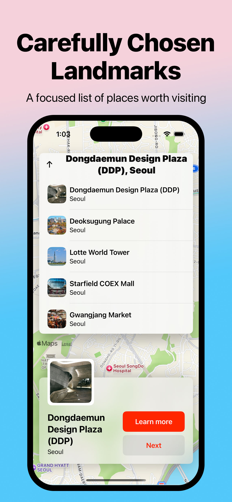
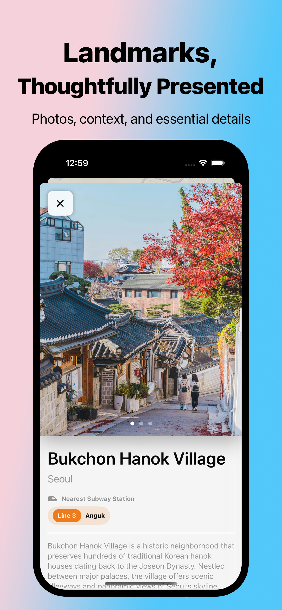
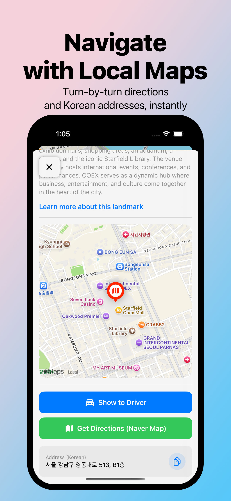
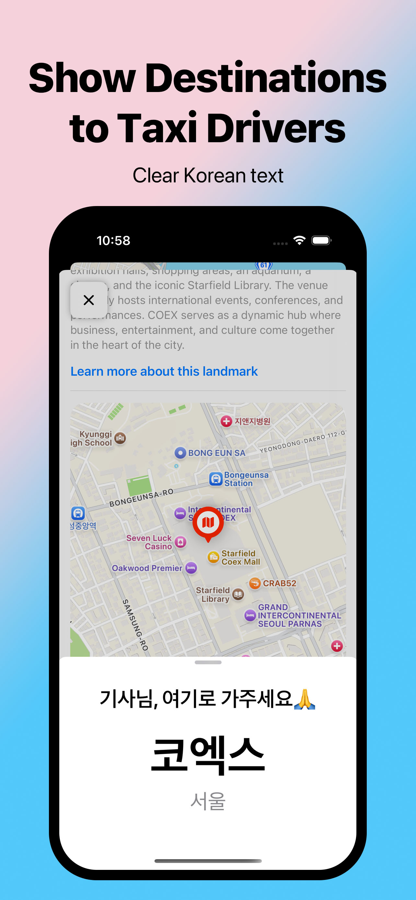

# K-Tour Hunters

K-Tour Hunters is a modern iOS application built with **SwiftUI** and **MapKit** that helps users discover and explore iconic tourist destinations across South Korea.

The app provides a clean, map‑first experience where users can browse curated landmarks, view detailed location information, and navigate between points of interest using smooth SwiftUI interactions. This project is designed as a **portfolio‑quality iOS app**, emphasizing Apple‑recommended architecture patterns, UI consistency, and real‑world MapKit usage.

---

## 📱 Screenshots

  &nbsp;&nbsp;&nbsp;
  &nbsp;&nbsp;&nbsp;
  &nbsp;&nbsp;&nbsp;
  

---

## ✨ Features

* Interactive **MapKit** map with custom annotations
* Curated Korean tourist landmarks (e.g. palaces, neighborhoods, cultural sites)
* Location detail cards with images and descriptions
* One-tap navigation to external map apps (Apple Maps and Naver Maps) for turn-by-turn directions
* Smooth SwiftUI animations and transitions
* Adaptive layouts that scale across iPhone sizes
* Clean separation of concerns using **MVVM architecture**

---

## 🛠 Tech Stack

* **Language:** Swift
* **UI Framework:** SwiftUI
* **Maps:** MapKit
* **IDE:** Xcode 16
* **Platform:** iOS 17+

---

## 🧱 Architecture Overview

K-Tour Hunters follows a lightweight **MVVM** structure:

* **Models** – Represent location data and domain entities
* **ViewModels** – Handle state, business logic, and map coordination
* **Views** – SwiftUI views composed of reusable UI components

This structure keeps UI logic declarative while making the app easier to scale and maintain as features grow.

---

## 🚀 Future Improvements

Planned enhancements include:

* Search and filtering for landmarks by category
* User location tracking and nearby place recommendations
* Offline caching of location data
* Localization support
* Deeper accessibility support (Dynamic Type, VoiceOver)
* Modular data loading from a remote API

---

## 📄 License

This project is for educational and portfolio purposes.

---

## 🔒 Privacy Policy

K-Tour Hunters does not collect, store, or share personal data.
The app uses Apple Maps and Naver Map for navigation.
No user accounts, analytics, or tracking are used.
